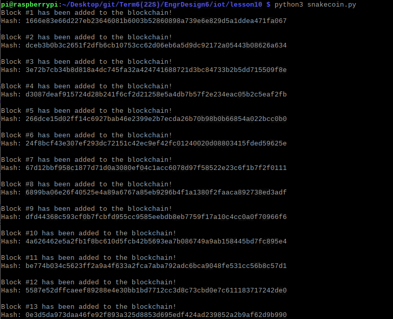
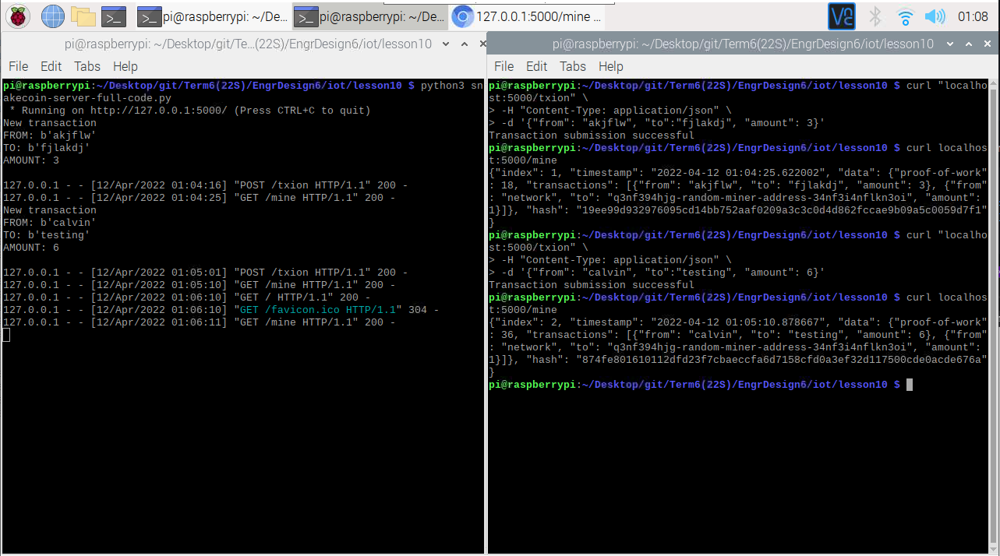

# Lab 10 -- Blockchain
For this lab, we were to demonstrate the usage of Blockchain and PyOTA.

The instructions for this lab can be found at [2022-04-11 Lesson 10: Design Analysis](https://goo.gl/7jZSGP). The picture of these instructions (seen below) was also taken from that presentation. In addition, the more in-depth lab instructions and the Python programs used can be found in the [lesson10](./lesson10) directory and were taken from Professor Kevin Lu's [iot directory](https://github.com/kevinwlu/iot/tree/master/lesson10)

## Submission
These commands were completed within the ssh terminal on my personal Raspberry Pi 3 Model B+ that is running *Raspbian GNU/Linux 10 (buster)*

### Lab 10A: Blockchain
Following the instructions in [lesson10](https://github.com/kevinwlu/iot/tree/master/lesson10), this lab was very straightforward. 

Results of running `hash_value.py` twice:

While the hash for the integer and decimals were the same between the two runs, the hash for the string, the tuple of vowels, and the custom object were different.

Results of running `snakecoin.py`:

The screenshot was only able to capture the first 13 blocks, but a total of 20 blocks were added to the blockchain.

Results of running `snakecoin-server-full-code.py` and mining blocks:

Results of running the Python blockchain app:

### Lab 10B: PyOTA
Again, like Lab 10A above, very straightforward. 

Results of running `iri_node_info.py`:

