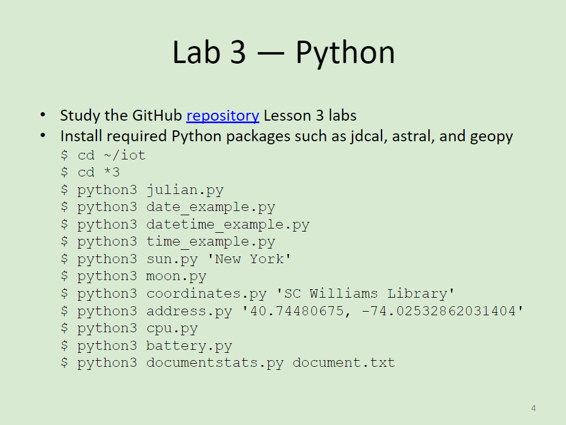
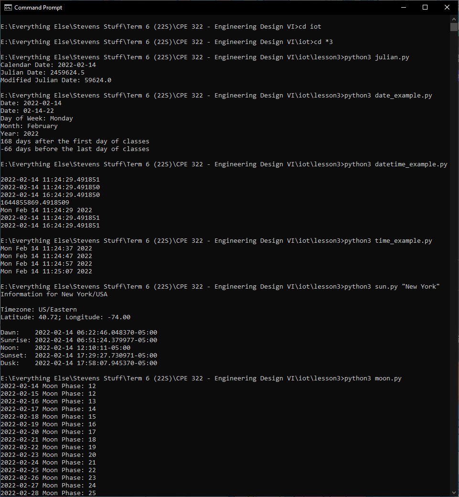
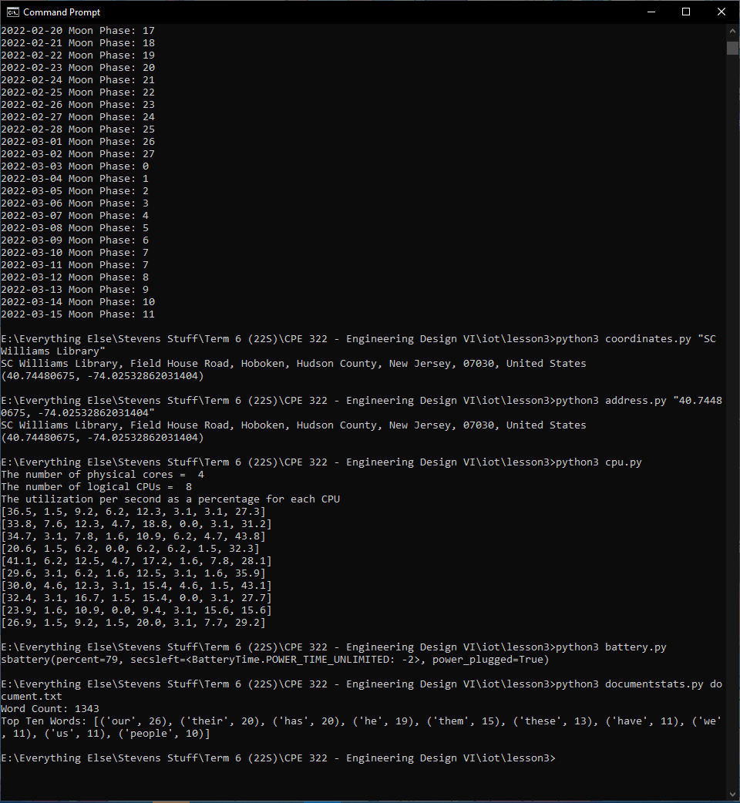

# Lab 3 -- Python
For this lab, we were to demonstrate the usage of some Python programs.

The instructions for this lab can be found at [2022-02-14 Lesson 3: Structuring the Search for the Problem](https://goo.gl/ZkuD4Z). The picture of these instructions (seen below) was also taken from that presentation. In addition, the Python programs that were executed can be found in the [lesson3](./lesson3) directory and were taken from Professor Kevin Lu's [iot directory](https://github.com/kevinwlu/iot/tree/master/lesson3)

## Submission
These commands were completed within the `cmd.exe` terminal on my personal desktop computer that is running *Windows 10 64-bit Build 19043*

