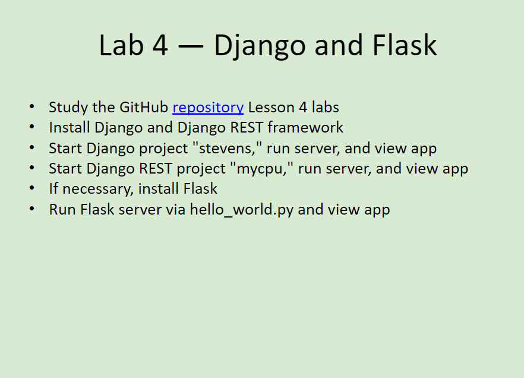
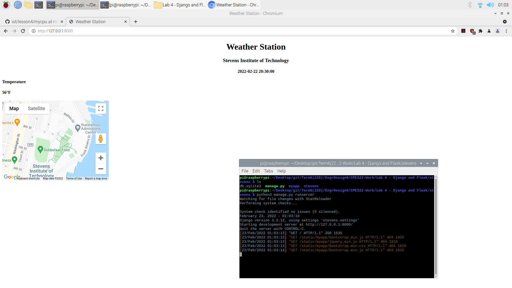
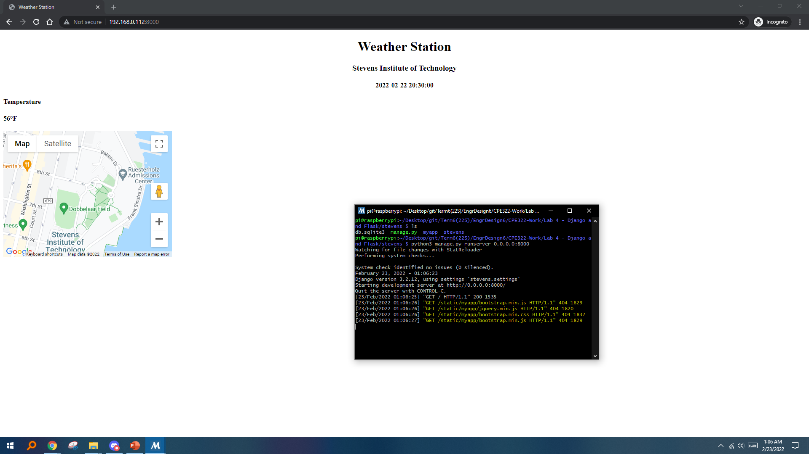
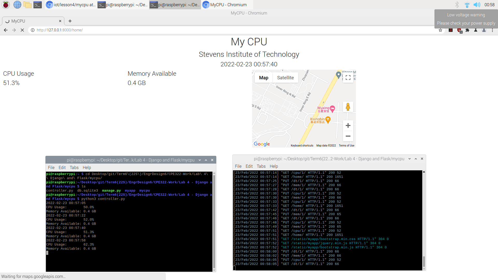
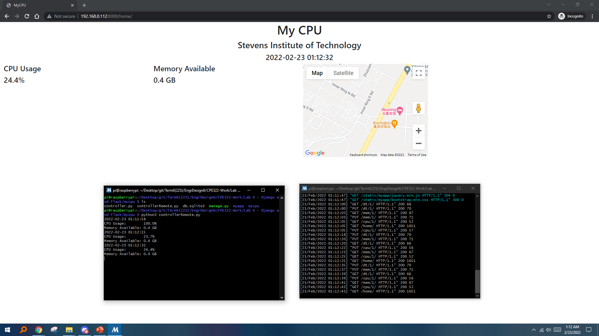
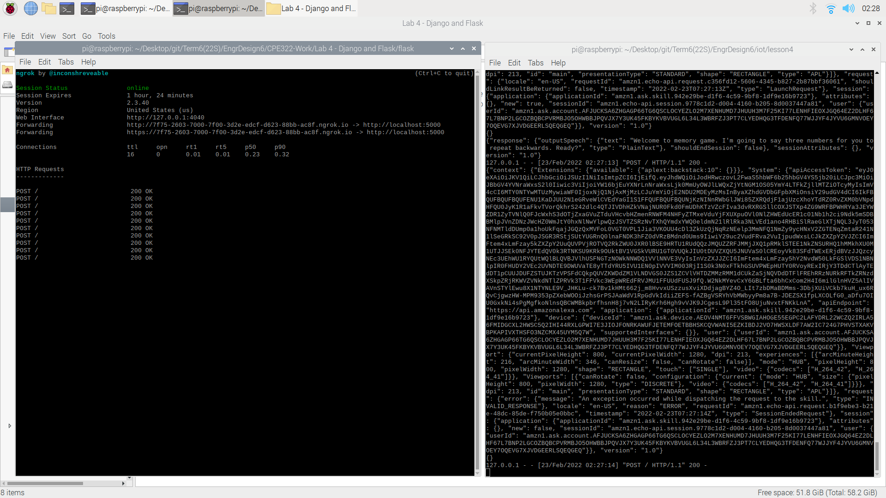
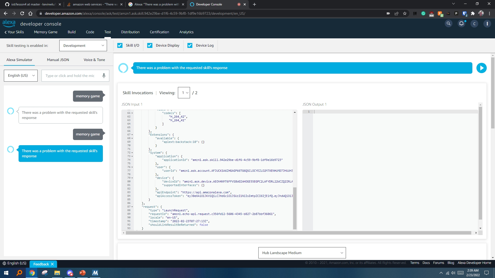

# Lab 4 -- Django and Flask
For this lab, we were to demonstrate the usage of Django and Flask to set up servers and view apps.

The instructions for this lab can be found at [2022-02-22 Lesson 4: Structuring the Search for a Solution](https://goo.gl/5o3d2k). The picture of these instructions (seen below) was also taken from that presentation. In addition, the more in-depth lab instructions and the Python programs used can be found in the [lesson4](./lesson4) directory and were taken from Professor Kevin Lu's [iot directory](https://github.com/kevinwlu/iot/tree/master/lesson4)

## Submission
These commands were completed within the ssh terminal on my personal Raspberry Pi 3 Model B+ that is running *Raspbian GNU/Linux 10 (buster)*

### Lab 4A and 4B: Django and Django REST framework on Raspberry Pi
This section took some time to set up, since I had to properly set up my Pi again. In addition, I was having some trouble with *Maps JavaScript API* key where my site loads, but the map says “This Page Can’t Load Google Maps Correctly.” Turned out that was because I did not set up a Billing account with the API yet. In the end, both `stevens` and `mycpu` worked well.

Working Django project `stevens` on the *Raspberry Pi*:

Working Django project `stevens` on remote machine (*Windows 10*):

Working Django REST framework project `mycpu` on the *Raspberry Pi*:

Working Django REST framework project `mycpu` on remote machine (*Windows 10*):

### Lab 4C: Flask
This section took me several hours before I decided to call it a night. After following the instructions in [lesson4](./lesson4), I ended with the error

- Alexa: "There was a problem with the requested skill's response"

I tried following the solution in [lesson4](./lesson4) to check the [Flask-Ask Requirements](https://github.com/johnwheeler/flask-ask/blob/master/requirements.txt), but that ended up not fixing my error. I also tried uninstalling and reinstalling the Flask-Ask `pip3` packages, as well as mixing and matching other versions of the packages in an attempt to get it working. I was also looking up other online solutions but could not find one to fit for this case. 

The outputs in the Pi looks like the server is trying to respond with the correct output for Alexa, but perhaps something happened along the way and Alexa would only spit back errors. Not too familiar with this setup so unfortunately I am not exactly sure how to deal with this case.

**Failed** Flask on the *Raspberry Pi*:

**Failed** Flask on remote machine (*Windows 10*):
