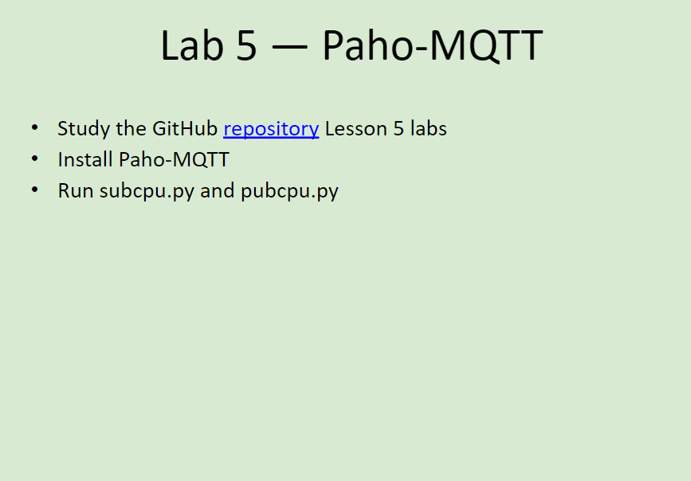
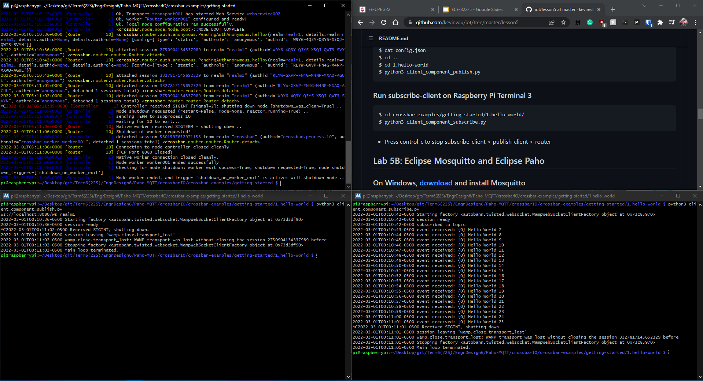
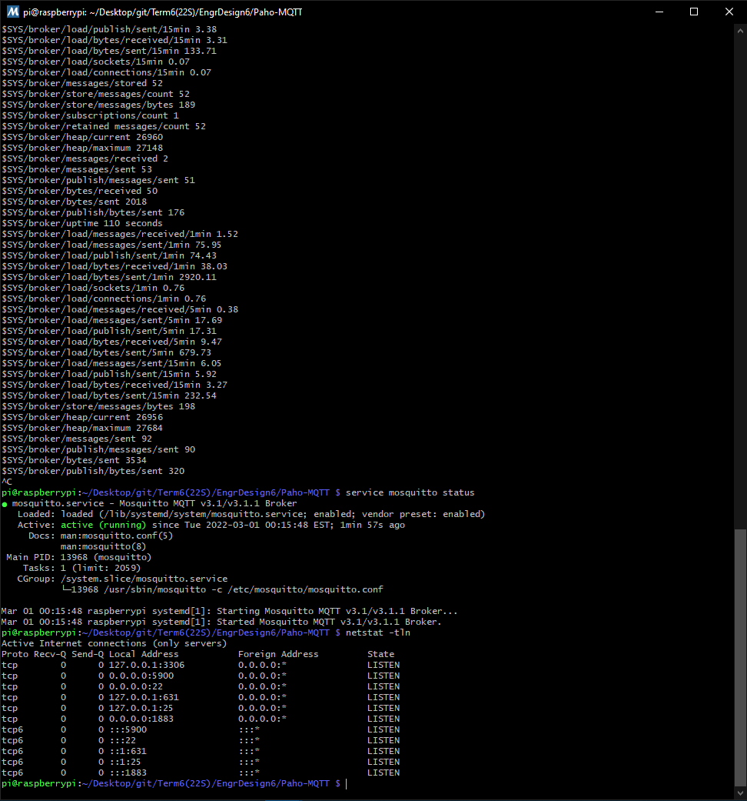
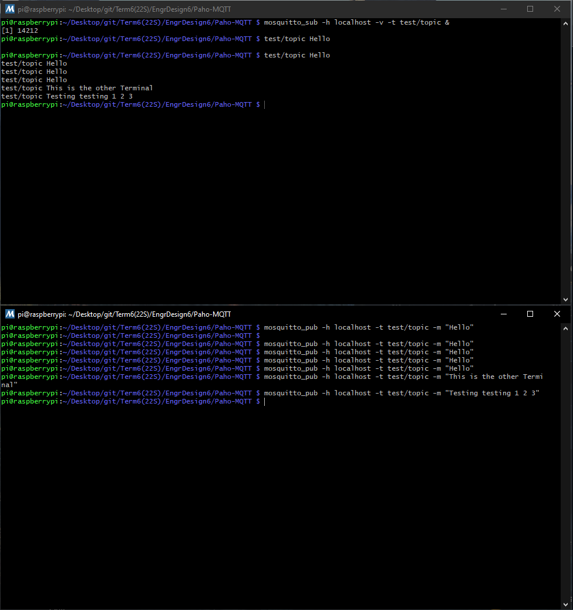
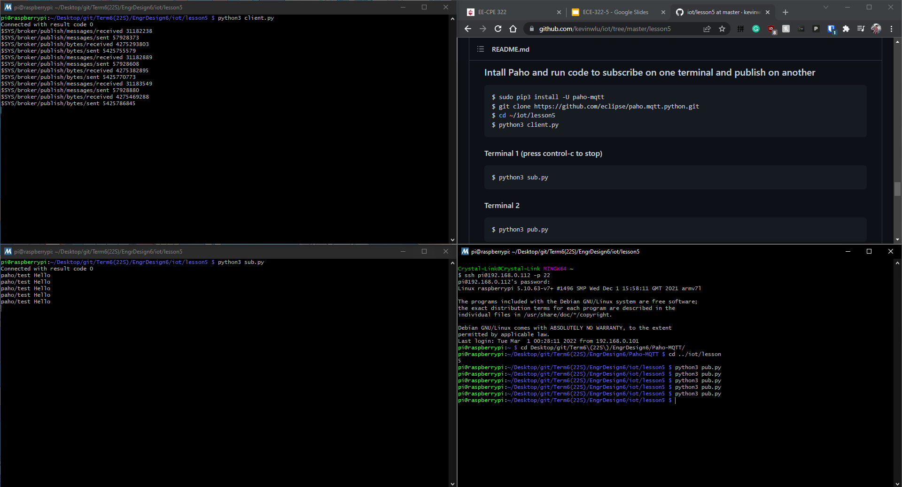
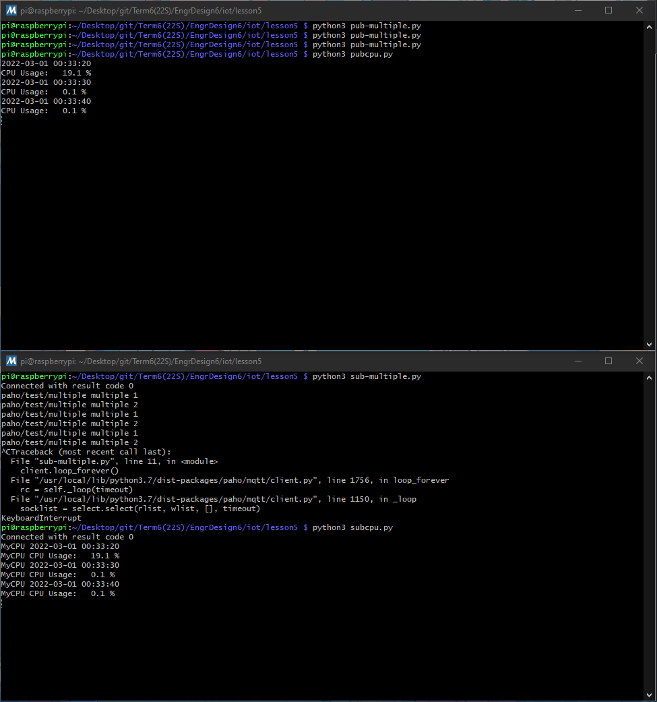

# Lab 5 -- Paho-MQTT
For this lab, we were to demonstrate the usage of Docker, Eclipse Mosquitto, and Eclipse Paho.

The instructions for this lab can be found at [2022-02-28 Lesson 5: Acquiring, Applying, and Protecting Technical Knowledge](https://goo.gl/CFoCsW). The picture of these instructions (seen below) was also taken from that presentation. In addition, the more in-depth lab instructions and the Python programs used can be found in the [lesson5](./lesson5) directory and were taken from Professor Kevin Lu's [iot directory](https://github.com/kevinwlu/iot/tree/master/lesson5)

## Submission
These commands were completed within the ssh terminal on my personal Raspberry Pi 3 Model B+ that is running *Raspbian GNU/Linux 10 (buster)*

###### Note: I originally thought this lab would only take around 10-20 minutes. Really disappointed that it ended up taking 5.5 hours instead due to errors along the way.

### Lab 5A: Crossbar.io
This part of the lab took way longer than it should have (~1 hour). After successfully installing Docker, when I tried to run the Crossbar.io router, I could not open the Crossbar.io node information page using my browser and was wondering if something went wrong or I had to go into VNC viewer to see the page. Turned out I was running Docker in the wrong directory and thus there were no workers configured to do anything. After running Docker again in the right directory, the node information page showed up.

Working Crossbar.io Node Information Page:

Next, I also ran into some trouble while setting up the publish-client on the second terminal. Since my Raspberry Pi is the 1GB model (only has 1GB of RAM), it was really slow in installing `autobahn[twisted,encryption,serialization,xbr]`. In addition, I was missing packages like `libglib2.0-dev`, `libcairo2-dev`, and `libgirepository1.0-dev`, causing the wheel building for `PyGObject` to fail. Therefore, I had to cancel the operation several times and install the packages requested, then rerun the pip3 installation. Not only that, I also ran into some error while building wheel for `numpy` as well. See [numpy_log.txt](./numpy_log.txt) for error output. Ended up giving up on the full update to `numpy` and just proceeded with the lab, since every attempt takes a lot of time and still ends in error. After a while of tinkering and trying to figure out what to do, I ended up seeing that the minumum version requirement for `numpy` in this lab is 1.20.1 so I upgraded to that (which was successful) and the `autobahn` installation finally ended successfully. Therefore, the whole operation ended up taking a lot longer than it should have (~4 hours).

Working Crossbar.io publish-client and subscribe-client:

### Lab 5B: Eclipse Mosquitto and Eclipse Paho
This part of the lab went smoothly. No major errors like those that I ran into in Lab 5A: Crossbar.io. In this part, I used Mosquitto and Paho to subscribe on one terminal and publish on another.

Working Mosquitto Service:

Working Mosquitto Subscribe and Publish Terminals:

Working Paho Client + Subscribe and Publish:

Working Paho Subscribe and Publish Multiple + CPU:

