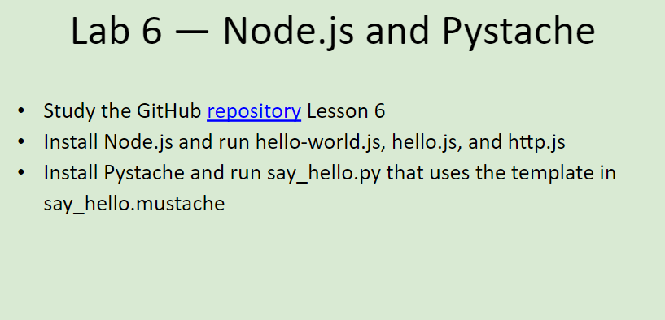
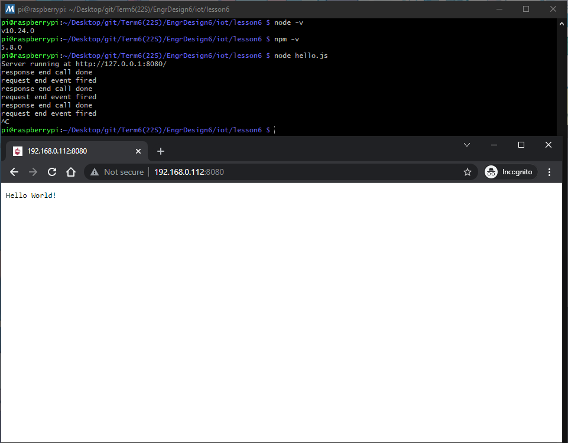
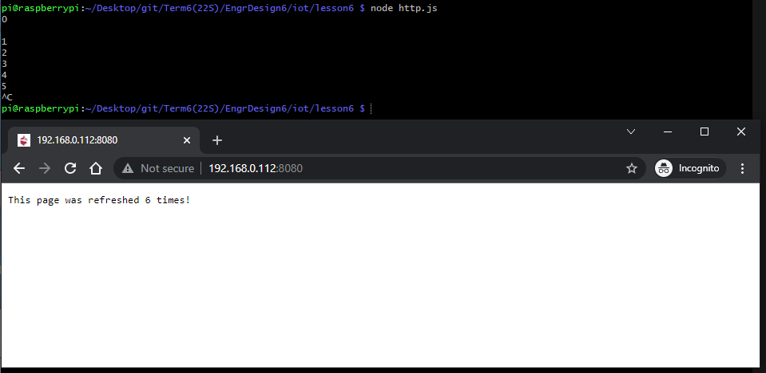
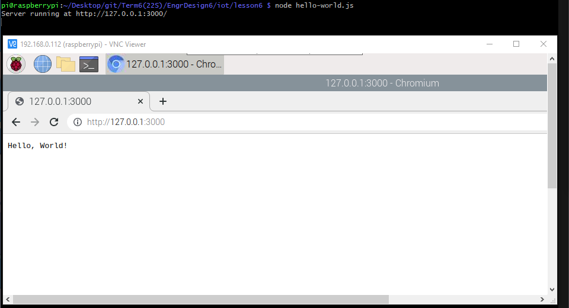
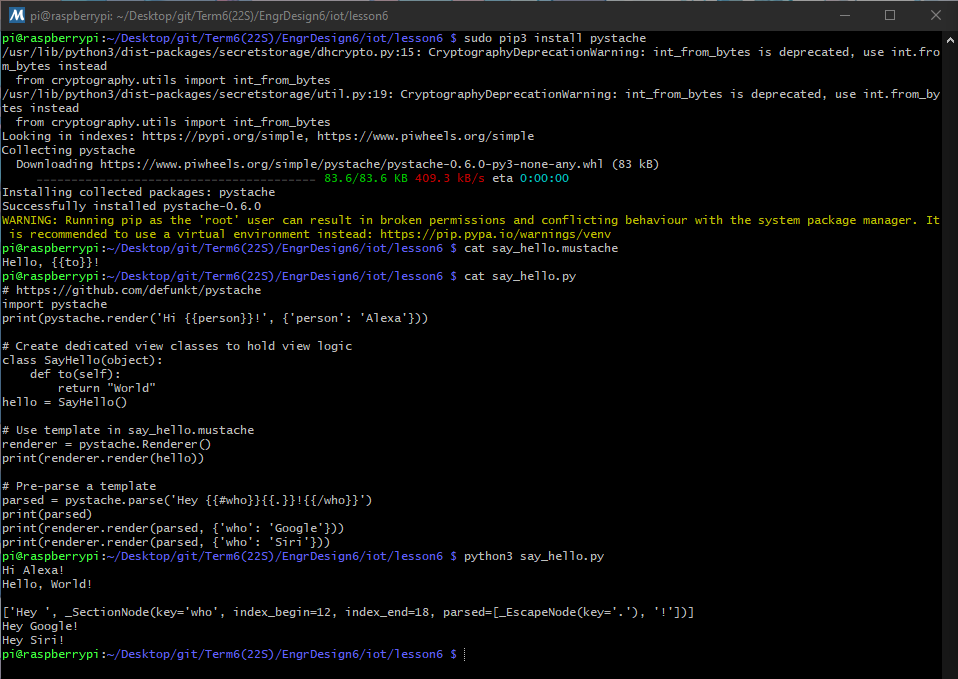

# Lab 6 -- Node.js and Pystache
For this lab, we were to demonstrate the usage of Node.js and Pystache.

The instructions for this lab can be found at [2022-03-07 Lesson 6: Abstraction and Modeling](https://goo.gl/eJ7zFn). The picture of these instructions (seen below) was also taken from that presentation. In addition, the more in-depth lab instructions and the Python programs used can be found in the [lesson6](./lesson6) directory and were taken from Professor Kevin Lu's [iot directory](https://github.com/kevinwlu/iot/tree/master/lesson6)

## Submission
These commands were completed within the ssh terminal on my personal Raspberry Pi 3 Model B+ that is running *Raspbian GNU/Linux 10 (buster)*

### Lab 6A: Node.js
Following the instructions in [lesson6](https://github.com/kevinwlu/iot/tree/master/lesson6), this lab was very straightforward. Install Node.js (or Node-RED on the Raspberry Pi) and run hello-world.js, hello.js, and http.js.
	- NOTE: The server ran by hello-world.js only works locally. Therefore, the screenshot for that server was done through VNC viewer and not directly on my Windows machine like the other two.

Working Node.js Server hello.js:

Working Node.js Server http.js:

Working Node.js Server hello-world.js:

### Lab 6B: Pystache
Again, like Lab 6A above, very straightforward. Install Pystache and run say_hello.py that uses the template in say_hello.mustache.

Working Pystache say_hello.py:

