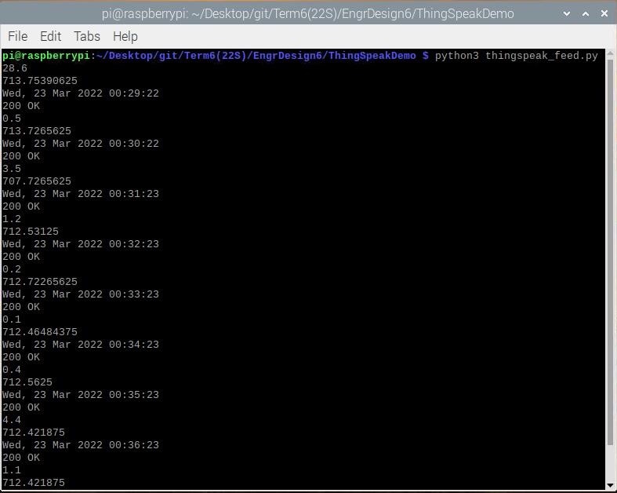
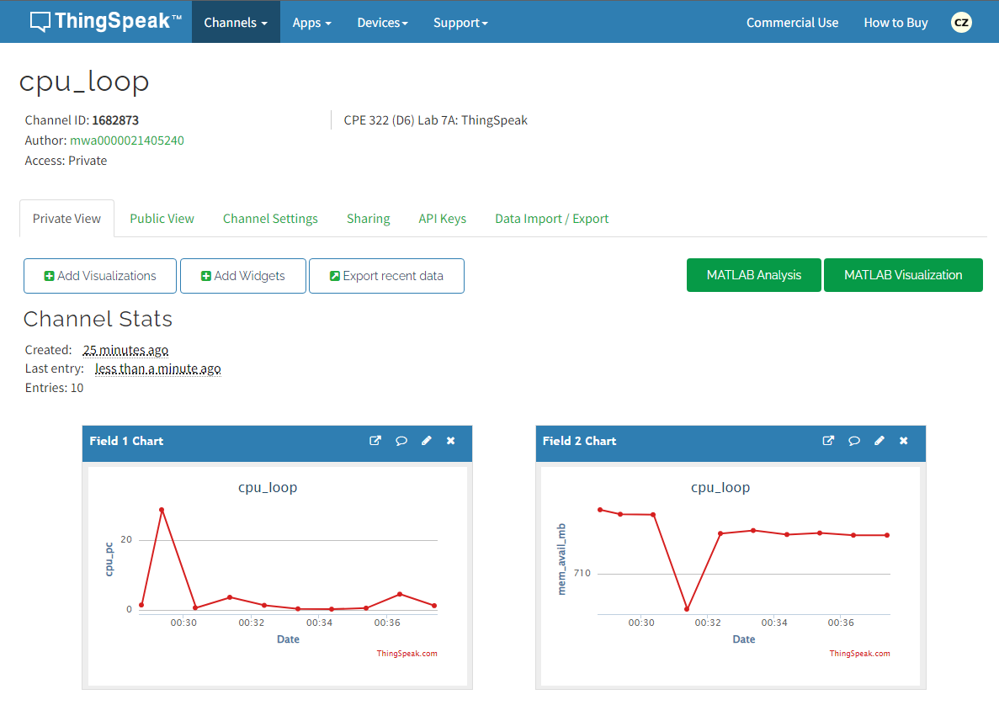
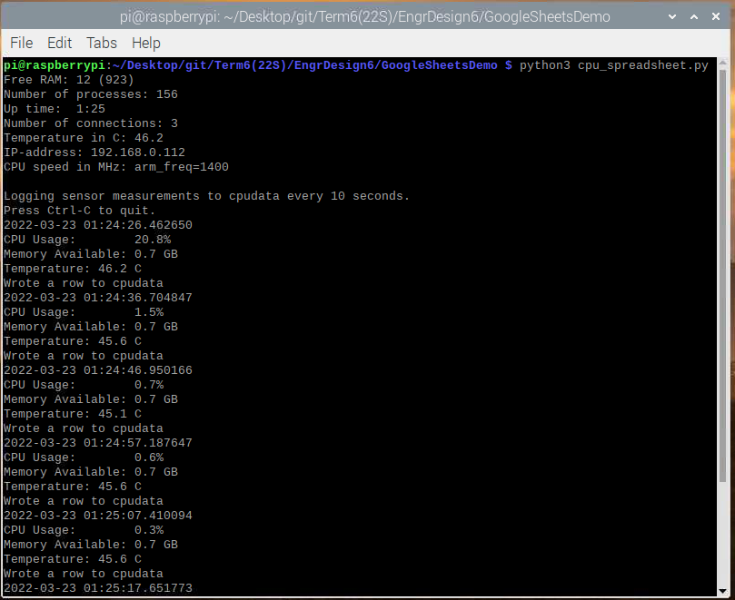
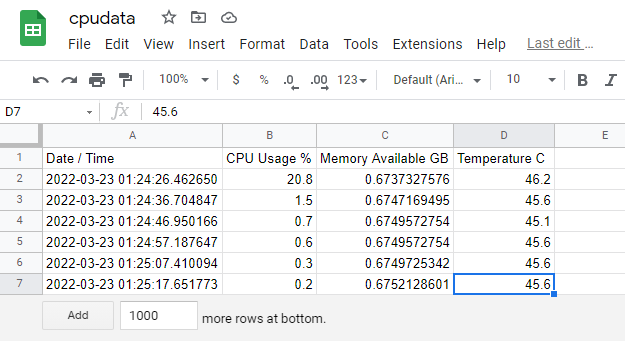

# Lab 7 -- ThingSpeak and Google Sheets
For this lab, we were to demonstrate the usage of ThingSpeak and Google Sheets.

The instructions for this lab can be found at [2022-03-21 Lesson 7: Synthesis](https://goo.gl/jWPvQz). The picture of these instructions (seen below) was also taken from that presentation. In addition, the more in-depth lab instructions and the Python programs used can be found in the [lesson7](./lesson7) directory and were taken from Professor Kevin Lu's [iot directory](https://github.com/kevinwlu/iot/tree/master/lesson7)

## Submission
These commands were completed within the ssh terminal on my personal Raspberry Pi 3 Model B+ that is running *Raspbian GNU/Linux 10 (buster)*

### Lab 7A: ThingSpeak
Following the instructions in [lesson7](https://github.com/kevinwlu/iot/tree/master/lesson7), this lab was very straightforward. 

Sign up for [ThingSpeak](https://thingspeak.com/) and created the new *cpu_loop* channel whose field1 is *cpu_pc* and field2 is *mem_avail_mb*. After getting the Write API Key from the generated channel and inputting that into the `thingspeak_feed.py`, I can run the code to feed my Pi's CPU usage and available memory to the ThingSpeak channel. I can then see that aside from the outlier points on the ThingSpeak channel charts, my Pi's util data is being graphed on the Field 1 and 2 charts.

Working thingspeak_feed.py:

Working ThingSpeak channel:

### Lab 7B: Google Sheets
Again, like Lab 7A above, very straightforward. 

Follow the instructions in [lesson7](https://github.com/kevinwlu/iot/tree/master/lesson7#lab-7b-google-sheets) to create and set up a new Google Cloud Platform project. Enable the Google Drive and Google Sheets API. Create a new service account and generate a JSON key for that service account, which will be used to feed data into the spreadsheet I created.

- Note: I did edit the cpu_spreadsheet.py to also feed the temperature data to the spreadsheet, which is why I have one extra column for the temperature being reported.

Working cpu_spreadsheet.py:

Working cpudata Spreadsheet:

