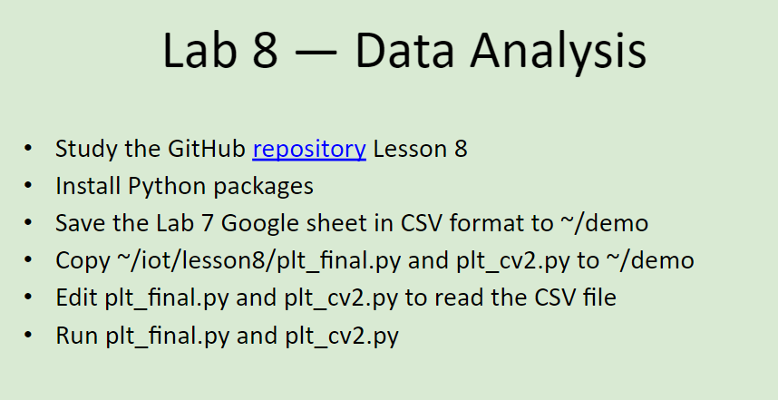
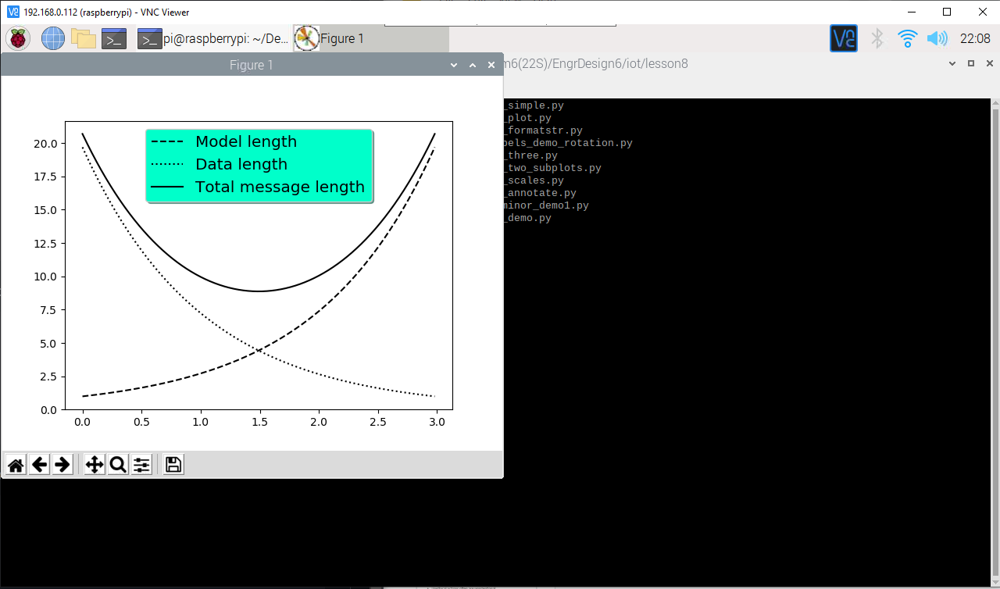
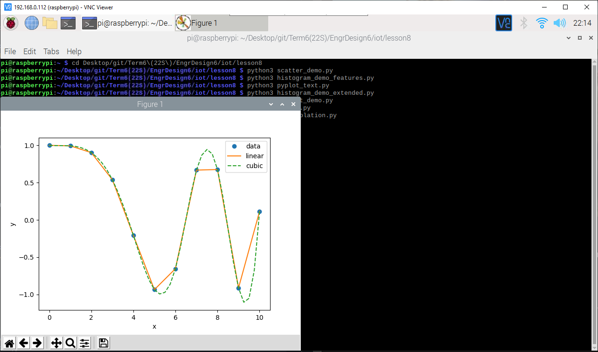
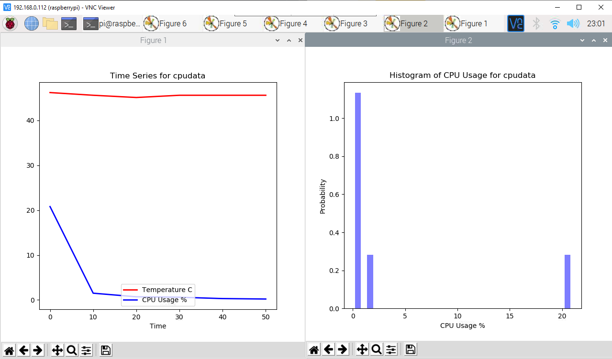
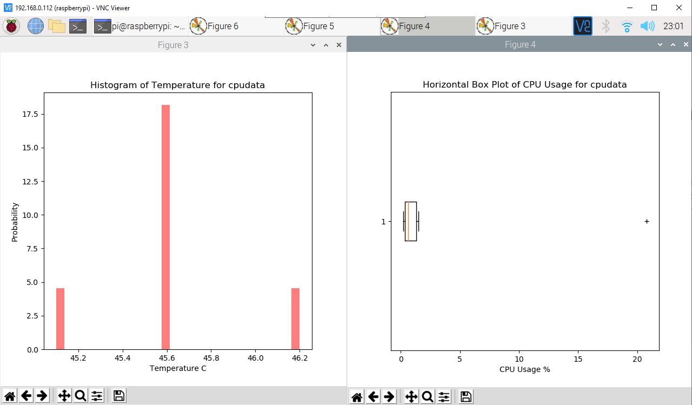
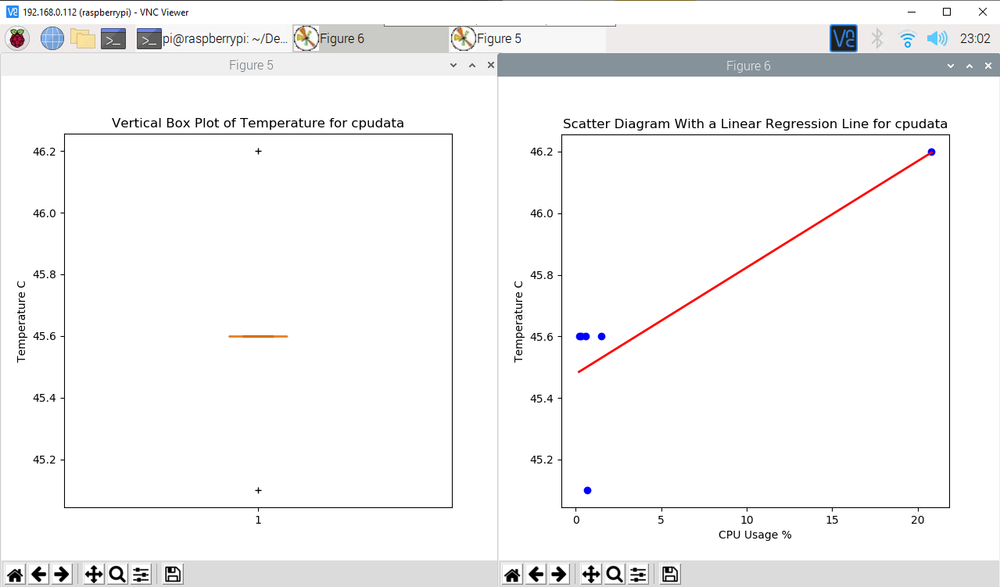
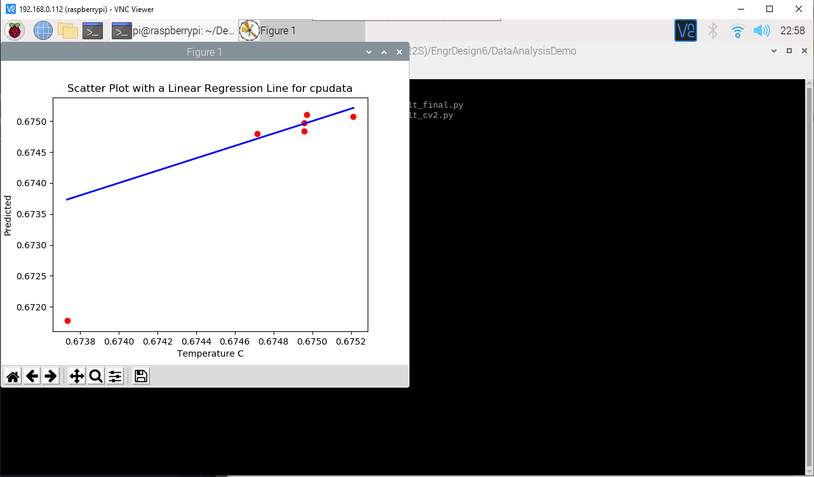

# Lab 8 -- Data Analysis
For this lab, we were to demonstrate the usage of Data Analysis tools.

The instructions for this lab can be found at [2022-03-28 Lesson 8: Ethics and Product Liability](https://goo.gl/HxZ1rt). The picture of these instructions (seen below) was also taken from that presentation. In addition, the more in-depth lab instructions and the Python programs used can be found in the [lesson8](./lesson8) directory and were taken from Professor Kevin Lu's [iot directory](https://github.com/kevinwlu/iot/tree/master/lesson8)

## Submission
These commands were completed within the ssh terminal on my personal Raspberry Pi 3 Model B+ that is running *Raspbian GNU/Linux 10 (buster)*

### Lab 8A: Examples
Following the instructions in [lesson8](https://github.com/kevinwlu/iot/tree/master/lesson8), this lab was very straightforward. 

First I had to install the required Python packages as listed in the lab instructions above. Then, to check if the packages are installed properly, run some of the example Python code provided in [lesson8](./lesson8).

NOTE: Trying to update `numpy` took extremely long, which was expected because this happened when I was installing `numpy` for Lab 5 - Paho-MQTT as well. The first attempt to update `numpy` returned `ERROR: Failed building wheel for numpy`, which was the same exact error as what had occured in Lab 5. However, this time my `pip` was slightly outdated, so I upgraded it and gave upgrading `numpy` a second shot. It ended in error again, so I reinstalled `numpy` version 1.20.1 and proceeded.

Working Example Code:

Working Interpolation Code:

### Lab 8B: Data Analysis
Again, like Lab 8A above, very straightforward. 

I am to analyze the Raspberry Pi date/time and CPU usage/temperature from Lab 7B. As per the instructions image above (as well as the instructions under Lab 8B in lesson8), I saved the Google Sheet created in Lab 7B in CSV format to a demo directory on my Raspberry Pi. Then copied `plt_final.py` and `plt_cv2.py` from lesson8 to the same demo directory. Edit the Python programs as necessary and ran the programs.

NOTE: The CSV file was originally downloaded on my Windows system and copied onto the Raspberry Pi using secure copy: `scp cpudata.csv pi@192.168.x.xxx:/home/pi/Desktop`

Working plt_final.py:

Working plt_cv2.py:

