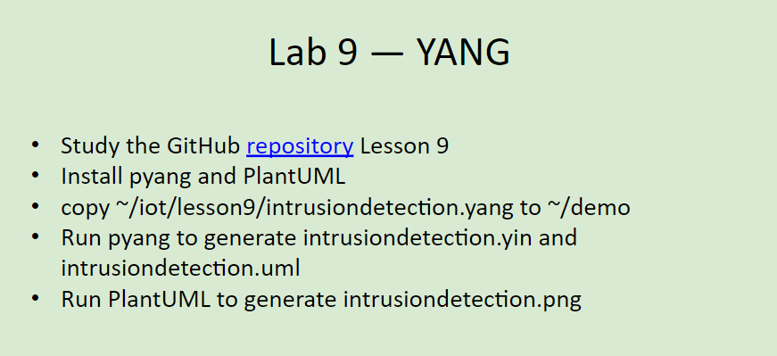
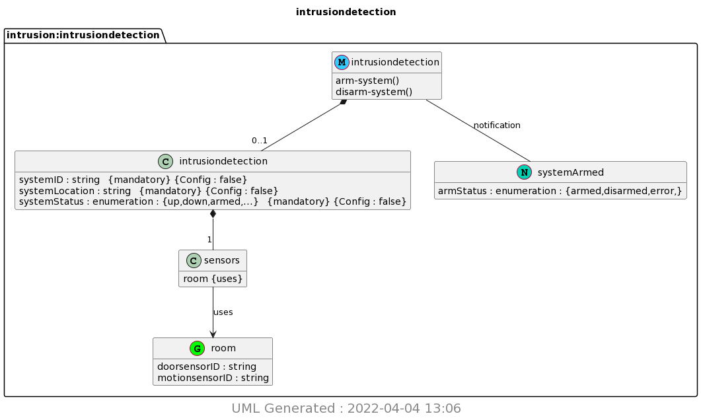
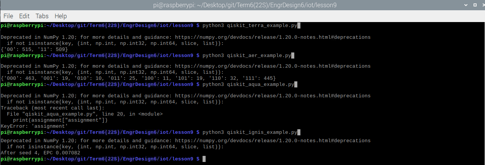

# Lab 9 -- YANG
For this lab, we were to demonstrate the usage of pyang and PlantUML.

The instructions for this lab can be found at [2022-04-04 Lesson 9: Hazards Analysis and Failure Analysis](https://goo.gl/7MEBxz). The picture of these instructions (seen below) was also taken from that presentation. In addition, the more in-depth lab instructions and the Python programs used can be found in the [lesson9](./lesson9) directory and were taken from Professor Kevin Lu's [iot directory](https://github.com/kevinwlu/iot/tree/master/lesson9)

## Submission
These commands were completed within the ssh terminal on my personal Raspberry Pi 3 Model B+ that is running *Raspbian GNU/Linux 10 (buster)*

### Lab 9A: YANG
Following the instructions in [lesson9](https://github.com/kevinwlu/iot/tree/master/lesson9), this lab was very straightforward. 

NOTE: No additional comments. This lab worked without any difficulties.

Resulting `intrusiondetection.png`:

### Lab 9B: Qiskit
Again, like Lab 9A above, very straightforward. 

NOTE: The below screenshot was photoshopped because every program returned a lot (probably thousands) of depreciation warnings for NumPy 1.20. Every program worked except for `qiskit_aqua_example.py`, which returned a KeyError.

Working Qiskit examples:

