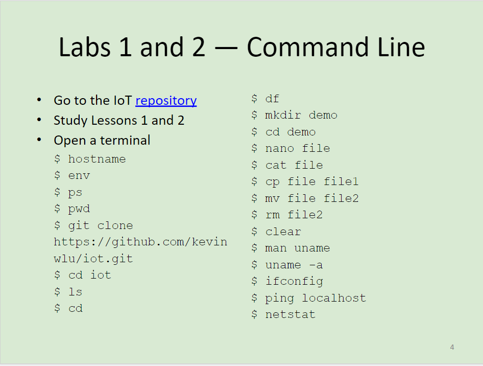
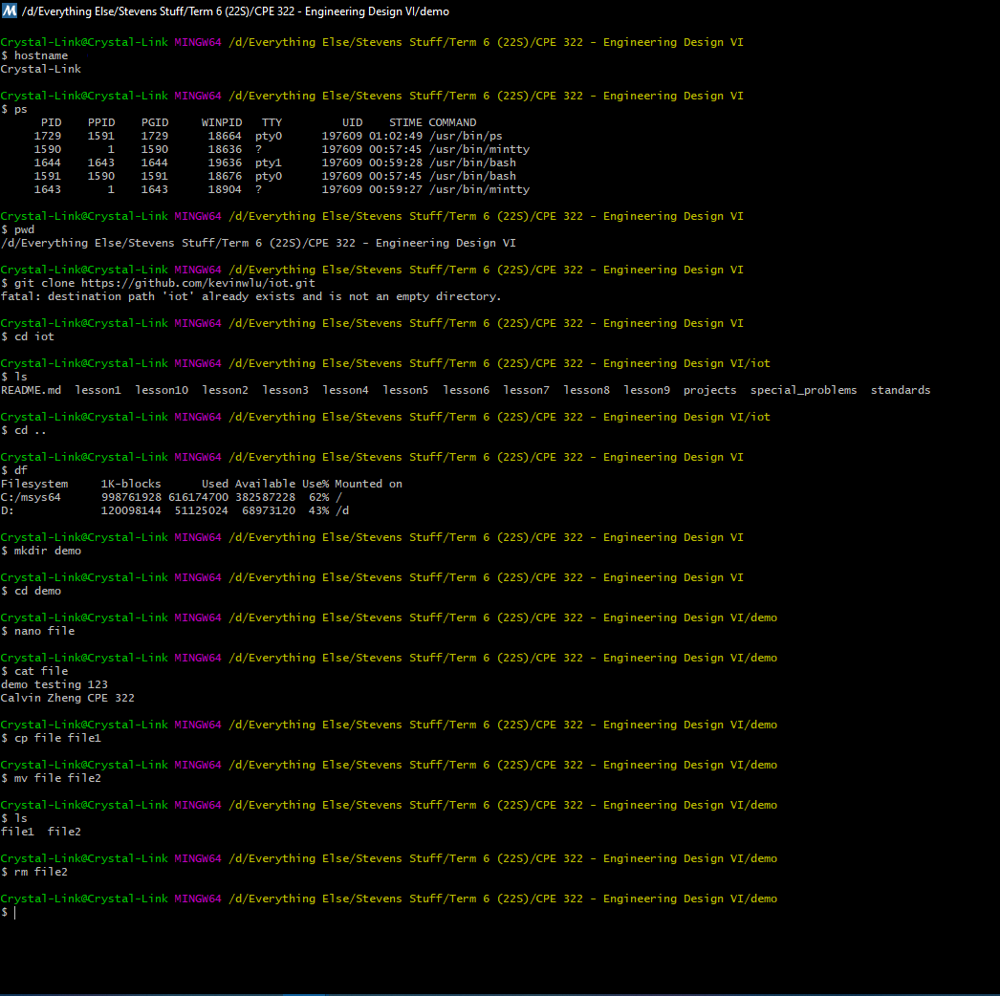
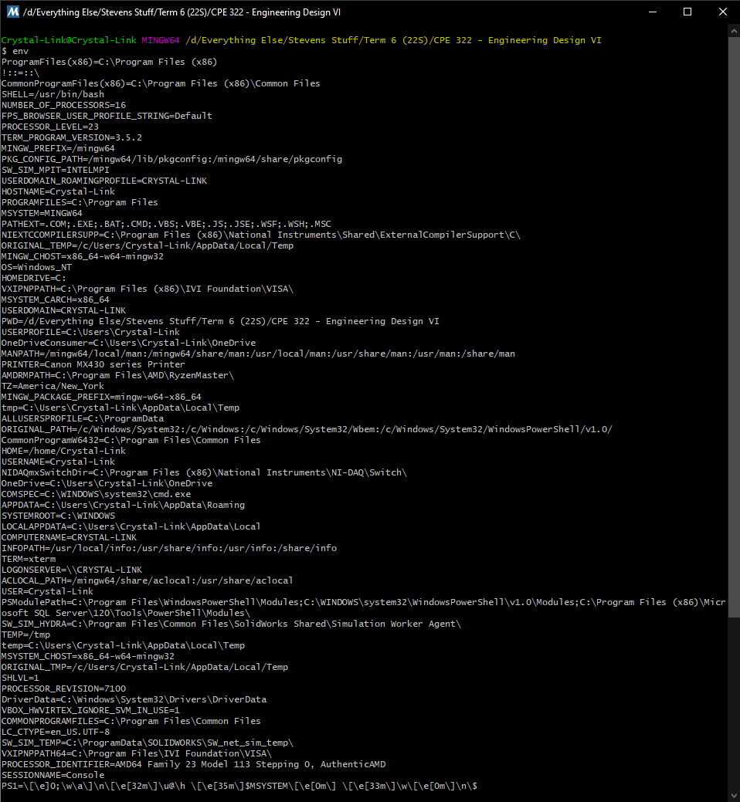
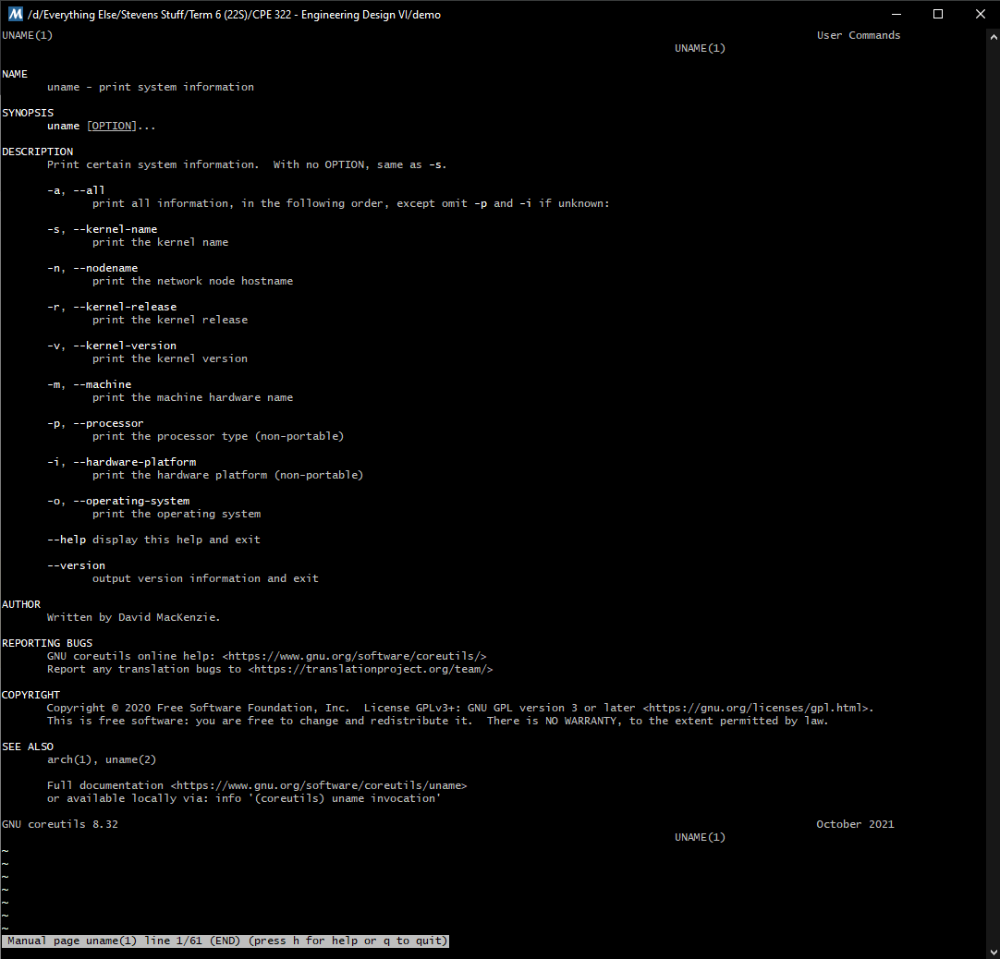
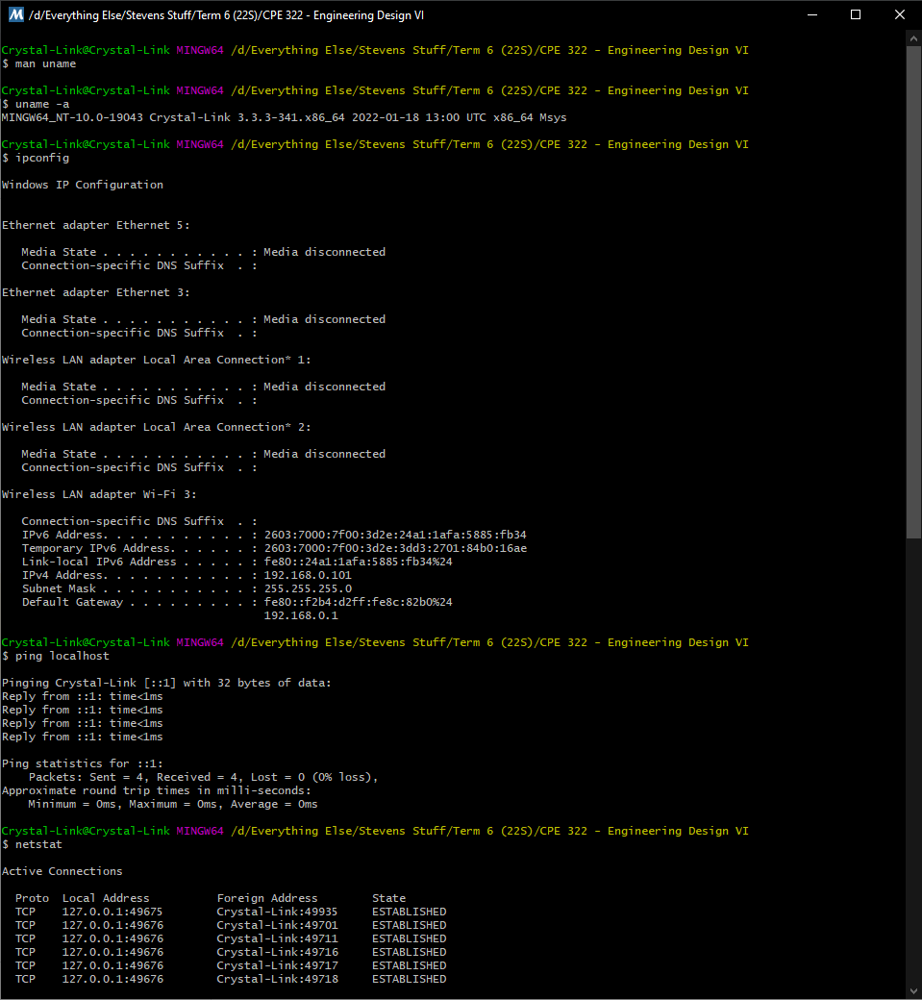

###### I pledge my honor that I have abided by the Stevens Honor System. @Calvin Zheng

# Labs 1 and 2 -- Command Line
For this lab, we were to demonstrate the usage of some Command Line commands within a terminal.

The instructions for this lab can be found at [2022-02-07 Lesson 2: Needs Assessment](https://goo.gl/7dhc9R). The picture of these instructions (seen below) was also taken from that presentation.

## Submission
These commands were completed within the `MSYS2 MinGW 64-bit` terminal on my personal desktop computer that is running *Windows 10 64-bit Build 19043*

